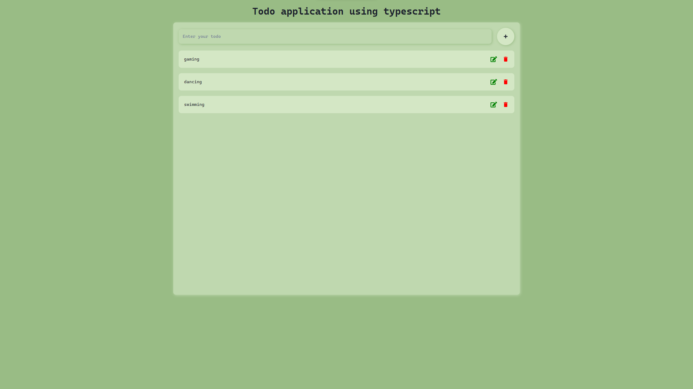

# Todo App

This is a simple Todo app to help you manage your tasks and stay organized.

## Features

- **Add Tasks:** Easily add tasks to your to-do list.
- **Mark as Complete:** Mark tasks as complete when you finish them.
- **Delete Tasks:** Remove tasks you no longer need.
- **Filter Tasks:** Filter tasks based on their completion status.

## Screenshots



## Getting Started

1. Clone the repository:

   ```bash
   git clone https://github.com/yourusername/todo-app.git
   ```
